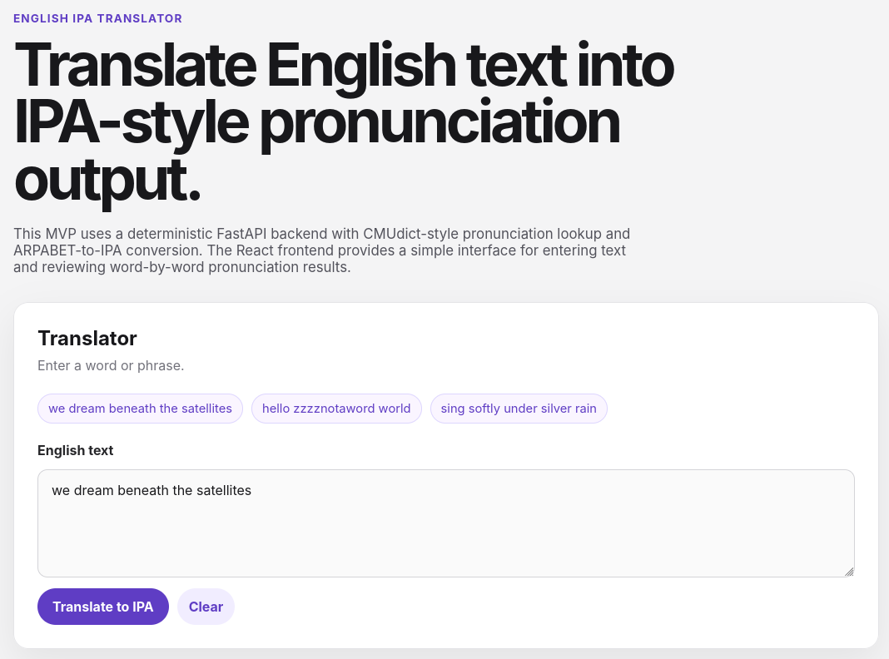
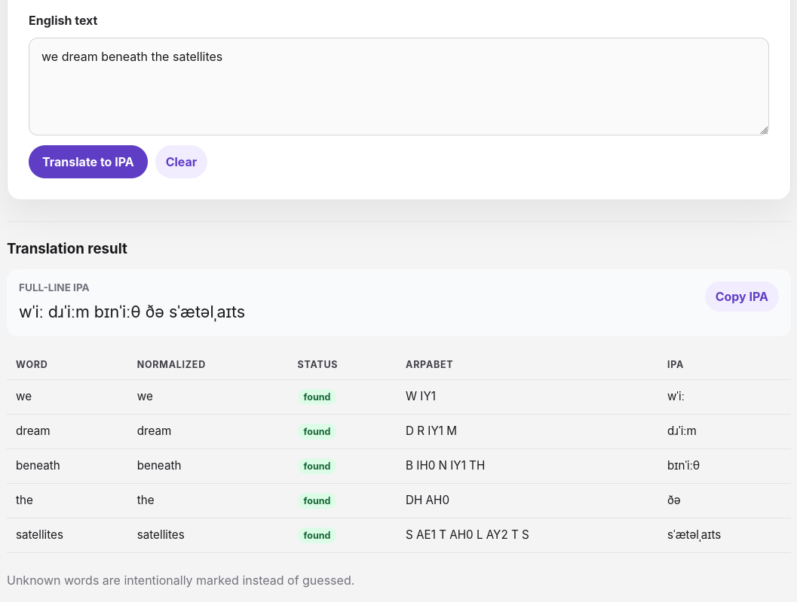
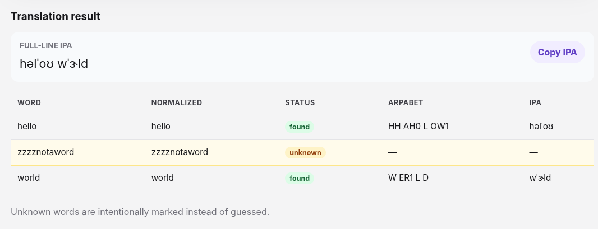

# English IPA Translator

A small full-stack web application that converts English words and phrases into IPA-style pronunciation output.

This project is the first milestone of a larger future pronunciation, rhyme, and text-analysis portfolio project. The current version focuses on deterministic pronunciation lookup and a clean React + FastAPI application structure.

## Screenshots

### Application Header

### Translation Results

### Unknown Word Handling

## MVP Goal

English text in, structured pronunciation data out.

The current pipeline is:

    raw English text
      ↓
    tokenize words
      ↓
    normalize tokens
      ↓
    look up CMUdict-style pronunciation
      ↓
    convert ARPABET phonemes to IPA
      ↓
    return structured JSON
      ↓
    display results in React

## Current Features

- React frontend built with Vite and TypeScript
- Plain CSS, no UI framework
- FastAPI backend
- Pydantic request and response schemas
- CMUdict-style lookup through the `pronouncing` package
- ARPABET-to-IPA conversion
- Unknown-word fallback
- Full-line IPA output
- Word-by-word pronunciation table
- Backend service tests
- Backend API tests
- Frontend lint and production build validation
- GitHub SSH push workflow

## What This MVP Does Not Use

This MVP does not use:

- machine-learning models
- LLMs
- embeddings
- transformer generation
- model training
- a database
- user accounts
- saved lyric projects

Those may become future projects or later milestones.

## Project Structure

    english-ipa-translator/
    ├── README.md
    ├── backend/
    │   ├── README.md
    │   ├── app/
    │   │   ├── api/
    │   │   ├── schemas/
    │   │   ├── services/
    │   │   └── main.py
    │   ├── tests/
    │   ├── pytest.ini
    │   └── requirements.lock.txt
    └── frontend/
        ├── README.md
        ├── package.json
        ├── package-lock.json
        ├── src/
        │   ├── api/
        │   ├── components/
        │   ├── types/
        │   ├── App.tsx
        │   └── main.tsx
        └── vite.config.ts

## Backend Setup

Python requirements and wheels are stored outside the project at:

    ~/Downloads/python-wheelhouse/requirements
    ~/Downloads/python-wheelhouse/wheels

Backend requirements file:

    ~/Downloads/python-wheelhouse/requirements/english-ipa-backend.txt

Create and activate the backend virtual environment:

    cd ~/Desktop/english-ipa-translator
    python3 -m venv backend/.venv
    source backend/.venv/bin/activate

Install backend requirements from the wheelhouse:

    python -m pip install \
      --no-index \
      --find-links="$HOME/Downloads/python-wheelhouse/wheels" \
      -r "$HOME/Downloads/python-wheelhouse/requirements/english-ipa-backend.txt"

Run backend tests:

    cd ~/Desktop/english-ipa-translator/backend
    source .venv/bin/activate
    pytest -v

Run the backend API:

    cd ~/Desktop/english-ipa-translator/backend
    source .venv/bin/activate
    uvicorn app.main:app --host 127.0.0.1 --port 8000

Backend health check:

    curl -s http://127.0.0.1:8000/api/health | python -m json.tool

Example translation request:

    curl -s -X POST http://127.0.0.1:8000/api/translate \
      -H "Content-Type: application/json" \
      -d '{"text":"we dream beneath the satellites"}' \
      | python -m json.tool

## Frontend Setup

Install frontend dependencies:

    cd ~/Desktop/english-ipa-translator/frontend
    npm install

Run the frontend development server:

    cd ~/Desktop/english-ipa-translator/frontend
    npm run dev

The frontend normally runs at:

    http://localhost:5173/

Run frontend lint:

    cd ~/Desktop/english-ipa-translator/frontend
    npm run lint

Run frontend production build:

    cd ~/Desktop/english-ipa-translator/frontend
    npm run build

## Running the Full App Locally

Terminal 1: backend

    cd ~/Desktop/english-ipa-translator/backend
    source .venv/bin/activate
    uvicorn app.main:app --host 127.0.0.1 --port 8000

Terminal 2: frontend

    cd ~/Desktop/english-ipa-translator/frontend
    npm run dev

Then open:

    http://localhost:5173/

## Example Input

    we dream beneath the satellites

## Example Output Shape

The backend returns structured data with:

- original input
- token list
- original token text
- normalized token text
- found or unknown status
- ARPABET pronunciation
- IPA pronunciation
- full-line IPA output

## Current Limitations

- Uses the first dictionary pronunciation for each word
- Does not yet support alternate pronunciation selection
- Does not yet perform syllable counting
- Does not yet calculate rhyme groups
- Does not yet calculate meter or stress grids
- Unknown words are marked unknown instead of guessed
- IPA output is useful for MVP exploration but not a complete phonetics engine

## Future Roadmap

Possible future milestones:

- alternate pronunciation display
- syllable counts
- stress pattern extraction
- rhyme detection
- slant rhyme helpers
- lyric line analysis
- meter grids
- custom dictionary entries
- saved lyric projects
- optional machine-learning fallback for unknown words
- transformer-assisted lyric suggestions in a separate later project

## Public Quick Start

This project does not require Debian specifically. It should run on Linux, macOS, or Windows with a compatible Python and Node.js environment.

Recommended prerequisites:

- Python 3.11+
- Node.js 20+
- npm
- Git

Terminal 1: run the backend

    cd backend
    python3 -m venv .venv
    source .venv/bin/activate
    python -m pip install -r requirements.txt
    uvicorn app.main:app --host 127.0.0.1 --port 8000

Terminal 2: run the frontend

    cd frontend
    npm ci
    npm run dev

Open the app:

    http://localhost:5173/

For the author's offline Debian workflow, see the wheelhouse and node-cache notes below.
